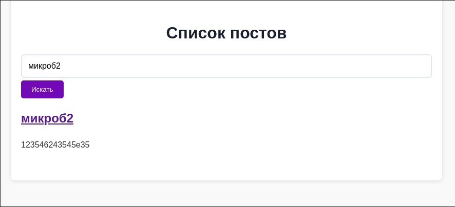

Миниблог на PHP, с использованием Laravel

В качестве СУБД - Sqlite

Маршруты: login,logout,posts,edit,create,register

Запуск
```sh
docker-compose up -d --build
```
 Работает на 
```sh
localhost:8000
```
Вход и регистрация:


Посты:


Поиск:

Редактирование:

Удаление:

